# Paper Library 项目架构

这个仓库本质上是一个 Obsidian 论文库，而不是传统应用工程。架构整理的目标是把“人工维护内容”“自动生成内容”和“自动化脚本”分清楚，避免后续新增论文、生成笔记或同步索引时互相污染。

## 顶层职责

| 路径 | 职责 | 维护方式 |
|---|---|---|
| `papers/` | 原始 PDF 论文文件 | 手动新增，脚本只扫描不改名 |
| `papers.csv` | 主索引和状态表 | 可手动编辑，也可由脚本更新 |
| `paper_library.xlsx` | `papers.csv` 的表格视图 | 由 `export-xlsx` 生成 |
| `notes/` | 精讲笔记和人工阅读沉淀 | 人工/自动共同维护 |
| `knowledge/` | 跨论文复用的基础知识、方法和概念解释 | 人工维护 |
| `literature/` | Obsidian 索引页和图谱入口 | 由 `sync-obsidian` 生成 |
| `figures/` | 论文图片、截图和图表裁剪结果 | 由图片提取/裁剪流程生成 |
| `extracted_text/` | PDF 文本抽取缓存 | 临时或半临时生成物 |
| `scripts/` | 本地自动化脚本入口 | 代码维护 |
| `docs/` | 项目结构、流程和约定说明 | 人工维护 |
| `.obsidian/` | Obsidian vault 配置 | Obsidian 和人工维护 |

## 图谱策略

默认全局图谱由 `.obsidian/graph.json` 控制。为了减少无意义边，默认隐藏以下节点：

- `literature/index.md`、`literature/unread.md`、`literature/read.md`、`literature/high-priority.md`、`literature/notes.md`、`literature/dataview.md`
- `literature/papers/index.md`
- `literature/maps/*`
- `literature/years/*`、`literature/venues/*`
- `knowledge/index.md`
- `figures/`、`extracted_text/`、`docs/`、`scripts/`、`README.md`

默认保留 `literature/papers/`、`literature/fields/`、`literature/topics/`、`notes/` 和 `knowledge/` 中的知识点正文。颜色分组为：论文蓝色，领域绿色，主题橙色，精讲笔记紫色，基础知识红色。

## 数据流

```mermaid
flowchart LR
  PDF["papers/*.pdf"] --> Scan["scan"]
  Scan --> CSV["papers.csv"]
  CSV --> Excel["export-xlsx -> paper_library.xlsx"]
  CSV --> Sync["sync-obsidian"]
  Sync --> Lit["literature/**"]
  CSV --> Pick["pick --reserve"]
  Pick --> Note["notes/*.md"]
  Knowledge["knowledge/*.md"] --> Lit
  Knowledge --> Note
  PDF --> ExtractText["extract"]
  ExtractText --> Text["extracted_text/*.txt"]
  PDF --> ExtractImages["extract-images / crop_image.ps1"]
  ExtractImages --> Figures["figures/<paper_id>/**"]
  Figures --> Note
  Lit --> Obsidian["Obsidian 图谱和 Dataview"]
  Note --> Obsidian
  Knowledge --> Obsidian
```

## 脚本层结构

`scripts/paper_manager.py` 是稳定入口，所有常用命令继续从这里执行。具体实现放在 `scripts/paperlib/cli.py`，后续如果继续拆分，可以按职责拆成 `index`、`obsidian`、`pdf`、`excel` 等模块，而不影响外部命令。

PowerShell 版本 `scripts/paper_manager.ps1` 是备用实现，用于没有可用 Python 环境的场景。它不参与 Python 包拆分，避免维护两个复杂模块树。

## 约定

- 不随意移动 `papers/`、`notes/`、`literature/`、`figures/` 这几个目录；Obsidian 双链、Markdown 图片引用和脚本默认路径都依赖它们。
- 基础知识笔记放在 `knowledge/`，每个文件聚焦一个概念；用链接连接相关 topic、field、论文页和精讲笔记。
- 人工优先维护 `papers.csv` 和 `notes/`；`literature/` 主要视为生成索引。
- 如果手动修改 Obsidian frontmatter 中的阅读状态、重要程度、细分领域等字段，应运行 `sync-obsidian` 回写并刷新索引。
- 新增功能优先保持 `python scripts/paper_manager.py <command>` 这个入口不变。
